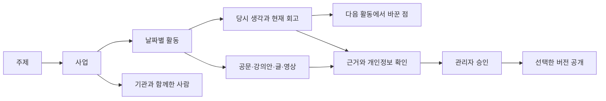

# 내가 해온 일을 다시 꺼내 쓰는 지식운영체계

교사 이운희의 지식운영체계는 수업과 사업에서 남긴 자료를 실제 경험과 연결하는 작업 공간을 목표로 한다. 경험이 중심이다. 무엇을 했는지, 왜 그렇게 했는지, 무엇을 바꿨는지를 근거 자료와 함께 남기고 다음 수업·연구·글쓰기에 다시 꺼내 쓴다.

이 문서는 프로젝트의 목적과 사용 흐름을 설명한다. 구상도 포함한다. 이 저장소의 기존 PKOS NEW, 별도로 개발 중인 지식운영체계 검토판, 개인 자료로 만든 로컬 샘플은 같은 실행본이 아니다. 아래에서 ‘구현’과 ‘예정’을 구분하며, 이 문서가 추가됐다고 저장소의 앱 기능까지 바뀐 것은 아니다.

## 왜 만들고 있는가

강의안은 PC 폴더에 있고, 당시 수업 이야기는 블로그에 있으며, 공문과 협의록은 다른 사업 폴더에 남아 있다. 흩어져 있다. 파일 하나를 찾더라도 그때 맡은 역할과 함께한 사람, 계획을 바꾼 이유까지 바로 떠올리기는 어렵다.

만들려는 방향은 다음 말에 담겨 있다. 사용자 의도다.

> AI가 다 해줄 수 있지만 내가 해온 것, 나의 소중한 자산을 정리하고 이것을 AI와 협업할 수 있도록 하자.

AI가 작성한 그럴듯한 경력 소개보다, 실제 했던 일과 그때 남긴 기록에서 시작한다. 근거를 남긴다. 공문은 어떤 일을 요청받았는지, 계획서는 무엇을 하려 했는지, 활동 기록은 실제 무엇을 했는지 설명한다. 선생님이 쓴 회고는 그 경험을 지금 어떻게 해석하는지 보여 준다.

‘문제해결자, 실천에서 찾아낸 이론’은 소개글에 먼저 붙일 수식어가 아니다. 사례로 쌓는다. 수업에서 만난 문제, 시도한 방법, 관찰한 결과, 다음에 고친 부분을 연결해 다른 교사도 그 과정을 따라 읽고 배울 수 있게 한다.

## 파일을 사업과 활동에 연결하기

‘드론’은 주제이고, 어느 학교에서 진행한 드론 수업은 사업 한 묶음이다. 차시는 나눈다. 같은 사업의 첫 수업과 다음 수업은 각각 활동으로 남기고, 강의안·사진·공문·블로그 글·영상은 해당 활동의 근거 자료로 연결한다.

| 기록 단위 | 담을 내용 |
|---|---|
| 주제 | 드론처럼 다시 찾아보고 싶은 관심과 문제 |
| 사업 | 사업명, 기관, 기간, 내 역할, 사업 번호 |
| 활동 | 날짜별 수업·협의·개발·발표와 실제 진행 내용 |
| 자료 | 원본 위치, 사본, 읽을 수 있는 본문, 출처와 쪽·영상 시각 |
| 함께한 사람 | 이름, 역할, 근거, 이름을 공개해도 되는지 |
| 내 생각 | 당시 작성한 글, 지금의 회고, 사실을 고칠 의견 |
| 공개본 | 선택한 내용과 자료, 승인한 버전, 수정·철회 기록 |

한 사업은 저서·TF팀·자료개발·민간 협력·지딜 등 여러 분류에 걸릴 수 있다. 복제하지 않는다. 사업 번호는 하나로 유지하고 연도·주제·기관·활동 종류로 여러 방향에서 찾는다. 이름이나 폴더가 바뀌어도 자료와 회고의 연결은 유지하는 방향으로 설계한다.

## 어떻게 사용할 것인가

### 주제를 말하고 자료 위치부터 확인한다

“드론 관련 기록을 정리해 줘”라고 요청하면 PC 파일·블로그·노션·유튜브에서 찾을 범위를 먼저 정한다. 목록부터 본다. 각 후보에는 원래 위치와 출처 종류, 읽었는지 여부를 표시한다. 접근하지 못한 출처와 아직 읽지 않은 자료는 빠짐없이 찾았다고 보고하지 않는다.

자료가 발견됐다는 사실만으로 내 실적을 확정하지 않는다. 확인이 먼저다. 참고로 받은 다른 사람의 강의안, 단순 안내 공문, 계획만 세운 사업을 실제 수행한 경력과 구분한다.

### 사업별 묶음을 검토한다

날짜·기관·사업명으로 사업 후보를 묶고 사용자가 맞는지 판단한다. 직접 고친다. 같은 사업의 여러 차시를 파일 중복으로 처리하지 않으며, 제목이 비슷하다는 이유만으로 다른 사업을 합치지 않는다. 같은 바이트의 사본도 원래 있던 위치를 남긴 뒤 처리한다.

활동 날짜와 공문 날짜, 블로그 작성일, 파일 수정일은 별도로 기록한다. 섞지 않는다. 날짜가 폴더 이름에서 나온 추정이면 그렇게 표시하고, 확인한 문장이나 쪽을 근거로 연결한다. 모르는 역할과 함께한 사람은 빈칸으로 둔다.

### 원본을 남기고 사본을 읽기 좋게 만든다

원본을 바로 이동하거나 이름을 바꾸지 않고 사본을 만든다. 원본은 남긴다. 내용 해시를 비교해 복사가 맞는지 확인하고, 사본에서 본문·표·이미지를 추출한다. 변환이 실패하면 원본 보관과 변환 실패를 따로 표시한다.

공문이나 강사카드를 PDF로 나눌 때는 개인정보를 확인한다. 사본에서 가린다. 연락처·계좌·생년월일·서명·학생 정보가 보이지 않는지 살피고, 가린 글자가 PDF의 텍스트나 첨부에 남아 있는지도 검사한다. 한 문서에서 확인한 가림 위치를 다른 문서에 그대로 적용하지 않는다.

### 그때의 기록을 읽고 지금의 생각을 쓴다

당시에 남긴 글과 오늘 쓴 회고는 나란히 보관한다. 덮어쓰지 않는다. “왜 그 도구를 골랐나”, “계획과 무엇이 달랐나”, “지금 다시 한다면 무엇을 바꿀까”처럼 실제 장면을 떠올릴 수 있는 질문을 사용한다.

사용자가 설명한 내용은 본인 진술로 남기고 근거 자료와 연결한다. 수정도 남긴다. AI는 날짜·기관·역할의 수정 후보를 제안할 수 있지만, 사용자가 느꼈을 감정이나 하지 않은 일을 만들어 채우지 않는다.

### 승인한 내용만 공개한다

공개할 사업 소개·날짜·역할·첨부·회고·참여자 이름을 각각 고른다. 기본은 비공개다. 근거와 개인정보를 확인하고 관리자에게 승인받은 버전만 공개본으로 만든다. 승인한 뒤 본문이나 첨부가 바뀌면 새 버전은 다시 검토한다.

다른 사람은 공개한 기록을 연도와 주제에 따라 읽으며 시행착오와 수정 과정을 탐색한다. 배움으로 이어진다. 프로필 페이지는 승인한 활동이 쌓인 뒤 대표 사례를 골라 마지막에 제작한다. 프로필 문구를 먼저 만들고 거기에 맞춰 경력을 채우지 않는다.

## 처음 만든 드론 샘플을 보는 방법

현재 첫 샘플은 개인 PC에서 검토하는 HTML이다. 별도 파일이다. 개인 자료의 원래 위치가 들어 있어 이 공개 저장소에는 올리지 않았다. 파일 이름은 `교사이운희_드론기록_검토.html`이며 아래 조작을 지원한다.

| 하고 싶은 일 | 샘플에서의 조작 |
|---|---|
| 특정 연도의 사업 읽기 | ‘연도’에서 값을 고른다 |
| TF팀이나 자료개발 후보 보기 | ‘활동 종류’를 고른다. 해당 자료가 없으면 없다고 표시한다 |
| 기억나는 장면 적기 | 사업 아래 회고 칸에 입력한다 |
| 사실 수정·함께한 사람 제안 | ‘사실을 고칠 부분이나 함께한 사람’에 입력한다 |
| 글을 파일로 보관하기 | ‘쓴 내용 파일로 보관’을 누른다 |
| 자료 위치 전체 보기 | ‘자료가 있는 곳’의 검색어를 비우고 목록을 펼친다 |

샘플의 회고와 수정 의견은 같은 브라우저에 임시 저장된다. 파일도 받는다. Google Sheets로 자동 전송하지 않으며 내려받은 JSON을 다시 가져오는 화면과 영구 수정 이력은 아직 없다. 브라우저 데이터를 지우기 전에 입력한 글을 파일로 보관한다.

샘플에 날짜와 기관이 표시됐다고 모두 확정된 경력은 아니다. 상태를 읽는다. 본문을 읽은 기록, 계획서만 확인한 기록, 파일명에서 찾은 후보를 따로 표시하며, 사용자가 샘플과 방법을 먼저 검토하는 단계다.

## 현재 되는 일과 아직 만들 일

아래 구현은 별도 로컬 검토판과 드론 샘플의 상태를 설명한다. 배포와 구분한다. 이 저장소를 내려받으면 모든 기능이 함께 실행된다는 뜻이 아니며, 기존 PKOS NEW 실행법은 루트 README에 남아 있다.

| 항목 | 현재 상태 |
|---|---|
| 파일 보관·변환·메모·직접 연결 | 로컬 검토판에 구현. 형식별 변환 한계가 있음 |
| 백업·별도 복원·변경 비교 | 격리된 시험 자료로 확인 |
| 선택 공개 파일과 버전 준비 | 로컬 생성·대조 구현. 인터넷 운영 완료와 별개 |
| 드론 사업 후보·연도별 필터·회고 | 로컬 샘플에 구현. 전체 드론 내용 분석은 미완료 |
| 사업·활동·자료 등을 나눠 시트에 기록 | CSV 구조 준비. 실제 Google Sheets 연결 전 |
| 관리자 로그인·비밀번호·버전 승인 | 설계 단계. 샘플 HTML에는 접근 통제 기능이 없음 |
| Google Drive 동기화 | 로그인·대조 코드와 모의 검사. 실제 계정과 다른 기기 확인은 미완료 |
| 노션·유튜브 개별 기록 수집 | 연결과 수집 미완료 |
| 근거를 찾아 답하는 RAG | 출처 구간 준비. 대화형 서비스·권한별 검색은 미구현 |
| 프로필 페이지 | 마지막 제작 단계로 남겨 둠 |

## Google Sheets·Python·AI의 역할

Python은 로컬 자료를 읽고 사본·변환본·목록을 만드는 일을 맡는다. 시트는 따로 둔다. 비공개 Google Sheets에는 사업·활동·자료·참여자·회고·공개승인을 나누어 기록하고 고정 번호와 수정 번호로 로컬 상태와 대조할 계획이다. 양쪽에서 같은 항목을 고쳤다면 덮어쓰지 않고 비교한다.

관리자 인증은 서버에서 확인하는 구조로 만든다. 비밀번호를 숨긴다. 원문 비밀번호를 시트나 HTML에 넣거나 브라우저에서 버튼만 가려 놓는 방식을 접근 통제로 취급하지 않는다. 공개 사이트는 승인된 내용만 따로 받아 보여 주며 개인 기록 전체를 내려받아 화면에서 숨기는 방식으로 만들지 않는다.

AI는 사용자가 고른 자료에서 사업·분류·연결·요약 후보를 제안한다. 결정은 남긴다. AI 제안, 원문 인용, 사용자가 채택한 내용은 구분하고 수정하거나 되돌릴 수 있게 한다. 외부 AI에 보낼 자료와 메모 범위도 전송 전에 확인한다.

RAG는 질문과 관련된 기록을 먼저 찾은 뒤 그 근거로 답하도록 만드는 기능이다. 출처로 돌아간다. 검색 결과에는 자료 번호·내용 버전·쪽이나 영상 시각을 붙이고 비공개 기록과 공개 기록을 분리한다. 승인 취소나 자료 수정이 검색 결과에도 반영되도록 설계하며, 문서를 나누어 저장한 것만으로 RAG가 완성됐다고 표현하지 않는다.

## 개발과 공개의 기준

대표 주제의 작은 묶음을 검토한 뒤 같은 규칙을 다른 자료에 적용한다. 대량 작업은 뒤다. 원본 위치 정리, 파일 삭제, 사업 통합, 시트 업로드, 공개 게시를 한 번에 자동 실행하지 않는다. PC 저장 완료·Drive 반영·다른 기기 수신은 각각 확인한다.

현재 추가 수집·대량 변환·제품 개발은 사용자의 샘플 판단을 기다리며 일시정지했다. 문서만 게시한다. 이번 GitHub 반영은 목적과 사용 흐름을 설명하기 위한 작업이며, 개인 원본·블로그 사본·학생 자료·내부 경로·비공개 회고·인증값을 포함하지 않는다.

샘플을 본 뒤에는 사업 묶음이 맞는지, 날짜와 역할의 근거가 충분한지, 어떤 회고와 첨부를 공개할지 판단한다. 그다음 잇는다. 첫 확인 항목은 ‘드론 수업의 여러 차시를 같은 사업 안의 별도 활동으로 묶어도 되는가’이다.

